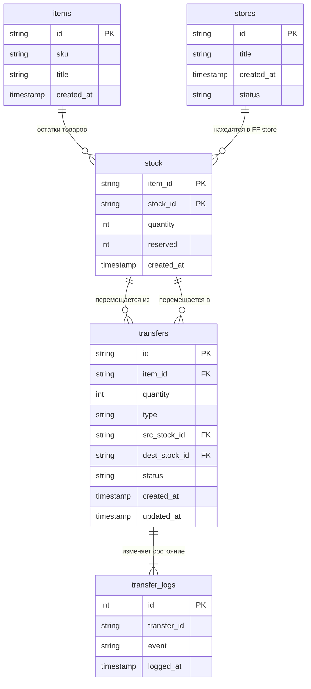

# ER diagram

```mermaid
erDiagram
    items ||--o{ stock : "остатки товаров"
    stores ||--o{ stock : "находятся в FF store"
    stock ||--o{ transfers : "перемещается из"
    stock ||--o{ transfers : "перемещается в"
    transfers ||--|{ transfer_logs : "изменяет состояние"
    
    items {
        string id PK
        string sku
        string title
        timestamp created_at
    }
    
    stores {
        string id PK
        string title
        timestamp created_at
        string status
    }
    
    stock {
        string item_id PK
        string stock_id PK
        int quantity
        int reserved
        timestamp created_at
    }
    
    transfers {
        string id PK
        string item_id FK
        int quantity
        string type
        string src_stock_id FK
        string dest_stock_id FK
        string status
        timestamp created_at
        timestamp updated_at
    }
    
    transfer_logs {
        int id PK
        string transfer_id
        string event
        timestamp logged_at
    }
    
```

